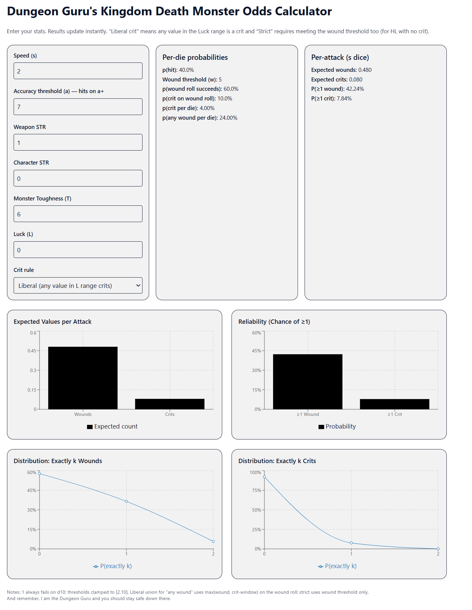
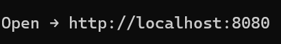

A basic web app that allows you to calculate hit/wound/crit rates 

Pull the repo down and from a cli tool run the following from the main dir
    1. `docker build -t kdm-odds .`
    2. `docker run --rm -p 8080:80 kdm-odds`
    3. You should see the following:
       
    4. Navigate there via browser or ctrl-click
    5. You should see the web app
    6. Have fun!